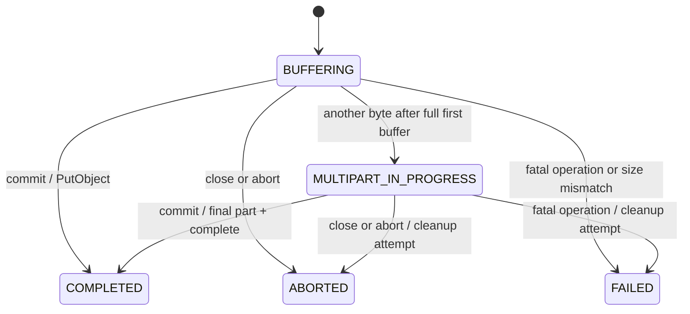

# S3 OutputStream

[](https://github.com/Arin016/s3-outputstream/actions/workflows/ci.yml)

Reviewing this as an engineering artifact? Start with the
[evidence brief](docs/engineering-evidence-brief.md), then inspect the
[benchmark report](docs/benchmark-results.md), [migration contract](docs/migration.md)
and [release gates](docs/release.md).

A synchronous Java `OutputStream` for S3, with explicit completion, a reusable
payload buffer, and testable multipart lifecycle handling. Java 11+.

**This branch is an unreleased `2.0.0-SNAPSHOT`.** It changes the default close
contract. Maven Central availability is not established; build locally to try it.
See [migration](docs/migration.md), [changelog](CHANGELOG.md), and
[release checklist](docs/release.md).

## Produce, then commit

```java
S3OutputStream.upload(S3OutputStream.builder()
        .s3Client(s3)
        .bucket(destinationBucket)
        .key(destinationKey)
        .contentType("application/zip"), out -> {
    try (ZipOutputStream zip = new ZipOutputStream(out)) {
        for (Path file : files) {
            zip.putNextEntry(new ZipEntry(file.getFileName().toString()));
            Files.copy(file, zip);
            zip.closeEntry();
        }
    } // finishes the ZIP; closing this producer view does not commit
}); // commits only if the producer returned normally
```

[Complete compilable example](examples/UploadZip.java). The caller supplies and owns the S3 client.

The helper gives the producer a close-shielded `OutputStream`, so closing a ZIP,
GZIP, writer or document wrapper cannot prematurely publish the object. Finish
all wrappers before the callback returns. Propagate producer exceptions; swallowing
an error and returning normally declares success. Do not retain/use the view after
the callback or launch background writes.

For direct control:

```java
try (S3OutputStream out = S3OutputStream.builder()
        .s3Client(s3).bucket(destinationBucket).key(destinationKey).build()) {
    generateDocument(out);
    out.commit(); // only after all production/finalization succeeds
}
```

Default `close()` aborts an uncommitted upload. Java try-with-resources therefore
cleans up if the producer throws. `commit()` is idempotent after success and rejects
aborted/failed streams; `close()` and `abort()` are idempotent after termination.
`abort()` reports cleanup failure as an `IOException`. The caller owns the S3 client.
The stream, builder and getters are not thread-safe.

A legacy opt-in, `.autoCommitOnClose(true)`, restores automatic completion on close.
It can publish partial output when a producer fails. The callback helper always
uses explicit completion, even when given a legacy-configured builder.

## Buffering and protocol limits

For part size `P` and final size `S`:

| Size | Behavior at commit | Storage requests, excluding retries |
| --- | --- | --- |
| `0 <= S <= P` | Single `PutObject` | 1 |
| `S > P` | Multipart | `ceil(S/P)` parts + initiation + completion |

The first full buffer is held until one additional byte arrives. `flush()` checks
that the stream is open, but does not publish or send an undersized non-final part.
Uploads are serial: a writing thread blocks while its part uploads. No executor,
background queue, parallel upload or adaptive sizing is hidden inside this SDK.

The default part size is 5 MiB. S3 permits at most 10,000 parts, with a 5 MiB minimum
except for the last part. Therefore the default fixed-part capacity is exactly
52,428,800,000 bytes (48.828125 GiB). A write exceeding the configured capacity fails
before accepting any bytes from that call and attempts abort. Earlier calls may
already have uploaded parts. [AWS multipart specifications](https://docs.aws.amazon.com/AmazonS3/latest/userguide/qfacts.html)

For an **exact known serialized length**, use:

```java
S3OutputStream.Builder config = S3OutputStream.builder()
    .s3Client(s3).bucket(destinationBucket).key(destinationKey)
    .expectedLength(exactBytes);
S3OutputStream.upload(config, out -> generateDocument(out));
```

This selects at least `ceil(exactBytes / 10000)` bytes per part, clamped to the
library minimum. An explicitly supplied insufficient part size is rejected.
Overrun during write or underrun at commit is fatal. An estimate, row count or
uncompressed ZIP input length is not an exact serialized length.

`MultipartLimits.partSizeFor(length)` and `capacity(partSize)` perform allocation-free
arithmetic. The implementation uses one Java array, so its part-size API is limited
to `Integer.MAX_VALUE - 8` bytes, below S3's maximum part size. Allocation still
requires sufficient heap. Unknown lengths use the configured fixed capacity;
there is no unlimited-size promise.

## Memory and failure semantics

The stream owns one reusable `P`-byte payload buffer and at most 10,000 ETag receipts.
The synchronous strategy exposes a replayable view over the valid buffer prefix
instead of creating another application payload copy. SDK, HTTP, producer, JVM,
compression and concurrent-stream memory are additional. See the
[measurement protocol](docs/benchmark-protocol.md); buffer size is not process RSS.

All terminal paths release this stream's buffer, upload ID and receipt list.
Scalar counters survive. `getCompletedParts()` returns a snapshot while open and
an empty list after terminal cleanup; caller-retained snapshots remain caller-owned.
Reference release makes objects eligible for reclamation; it does not schedule GC.



These are runtime states. `ABORTED` records local intent; it does not certify remote
cleanup. `FAILED` records a local error; a lost PutObject/completion response can
hide a successful remote publication. Abort cannot remove that final object, and
this library never deletes an existing object. Use application-specific reconciliation
where ambiguous outcomes matter.

On multipart failure the primary upload cause is retained and any abort failure
is suppressed on the upload exception. If the producer fails and close also fails,
try-with-resources suppresses close failure on the producer exception. The library
attempts cleanup once per terminal transition. Configure client retries/timeouts
and an S3 lifecycle rule for abandoned multipart uploads. A crash or failed abort
can leave billable parts; cleanup is not guaranteed.

Interruption is checked before write/flush/commit and storage calls. It preserves
the interrupt flag and triggers best-effort cleanup. It does not forcibly cancel
an arbitrary synchronous HTTP call; client timeouts remain necessary.

## Object properties and observation

The builder supports `contentType(...)` and defensively copied `metadata(...)`
on both PutObject and multipart initiation. Broader encryption, object-lock,
conditional-write, checksum, storage-class and resumability controls are outside
this version's API. Supply client retry, timeout, credential and region settings
through your S3 client.

```java
builder.listener(event -> metrics.record(
    event.type(), event.state(), event.bytesWritten(),
    event.bytesUploaded(), event.partNumber(), event.elapsedNanos()));
```

Listeners receive identifier-free scalar events for start, protocol selection,
accepted bytes, parts, completion and failure/cleanup. They execute synchronously,
so keep them fast and never reenter the stream. Listener RuntimeExceptions are
isolated and counted by `getListenerFailures()`. SDK retry attempts are not separate
library events. Default exception messages omit bucket/key; underlying SDK causes
may still contain identifiers and should be sanitized before logging.

## Build, test and evaluate locally

```bash
./mvnw verify --no-transfer-progress
./mvnw install --no-transfer-progress
```

The local-install coordinates are `io.github.arin016:s3-outputstream:2.0.0-SNAPSHOT`.
AWS S3 remains a `provided` dependency: consumers supply their client dependency.
The tested dependency set is pinned in the POM and CI. This does not promise
compatibility with every AWS SDK version.
Consumers manage their own AWS/HTTP versions; this library's dependency management
does not automatically override an application's dependencies. See the dated
[dependency review](docs/release.md#dependency-policy-and-advisory-review).

The default Maven suite has no S3 network access. See
[local integration instructions](tools/local/README.md) and
[benchmark reproduction](tools/benchmarks/README.md) for the gated loopback fixture.
The CI workflow is configured for Java 11/17/21. Clean local builds passed 75 unit
tests and 16 local integration tests per JDK on 2026-09-07. Evidence distinguishes local runs from
remote CI, releases and real-S3 validation.

Real AWS tests are a separately gated manual program and require explicit
operator authorization plus a dedicated disposable bucket/key prefix. No real-S3
success is claimed by local fixture tests.

## Alternatives and scope

Whole-object buffering is simple and can be effective for bounded small outputs.
Temporary files decouple generation from upload and support replay. AWS provides
[`BlockingOutputStreamAsyncRequestBody`](https://docs.aws.amazon.com/java/api/latest/software/amazon/awssdk/core/async/BlockingOutputStreamAsyncRequestBody.html)
for an async client, and
[CI-CMG's S3 OutputStream](https://github.com/CI-CMG/aws-s3-outputstream) already offers
queued upload and an explicit success option. This project is a compact synchronous
choice; it is not the first or only S3 OutputStream.

The [engineering article](docs/article.md), ready for author review, and [benchmark report](docs/benchmark-results.md)
explain the evaluated trade-offs and limitations. Internal export-system anecdotes
are not measurements of this public SDK. A public comment in
[AWS issue 3128](https://github.com/aws/aws-sdk-java-v2/issues/3128#issuecomment-4684884362)
is design discussion, not AWS adoption or endorsement.

Apache License 2.0; see [LICENSE](LICENSE) and [NOTICE](NOTICE).
