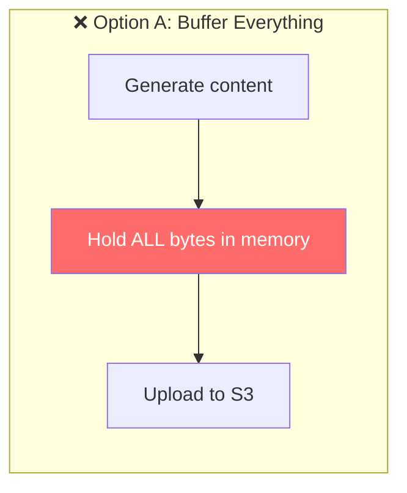
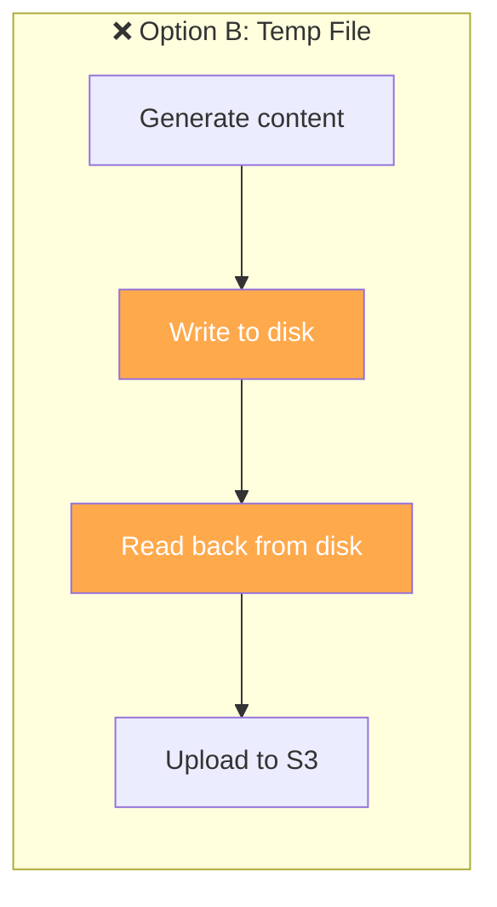
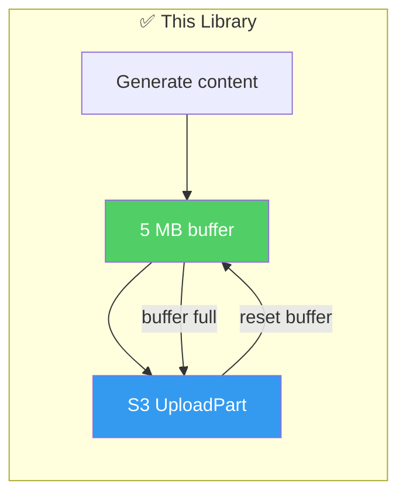
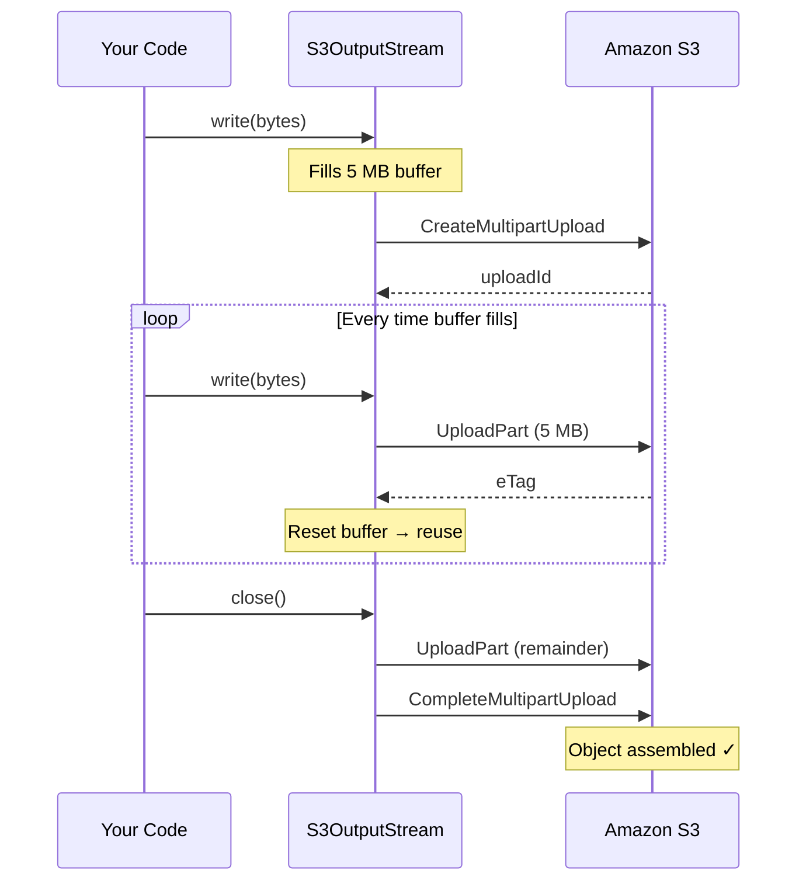
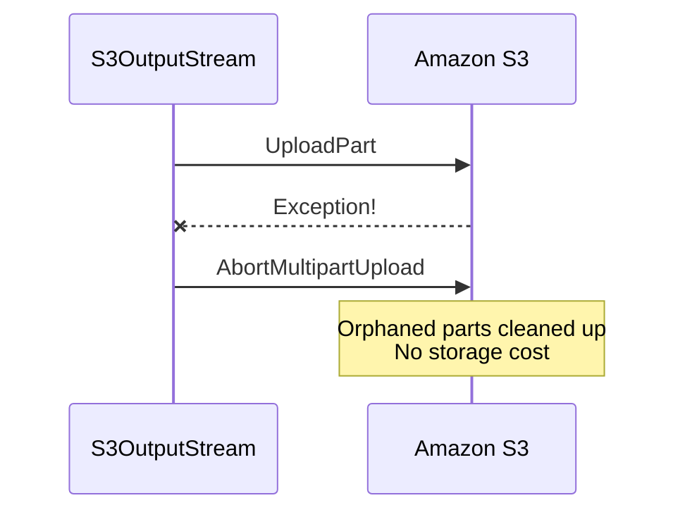
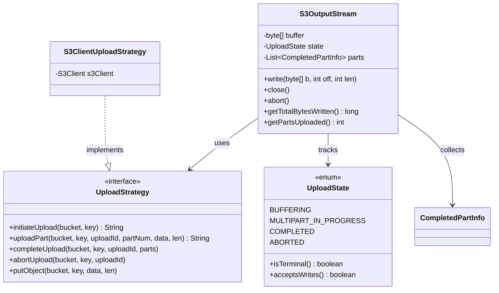
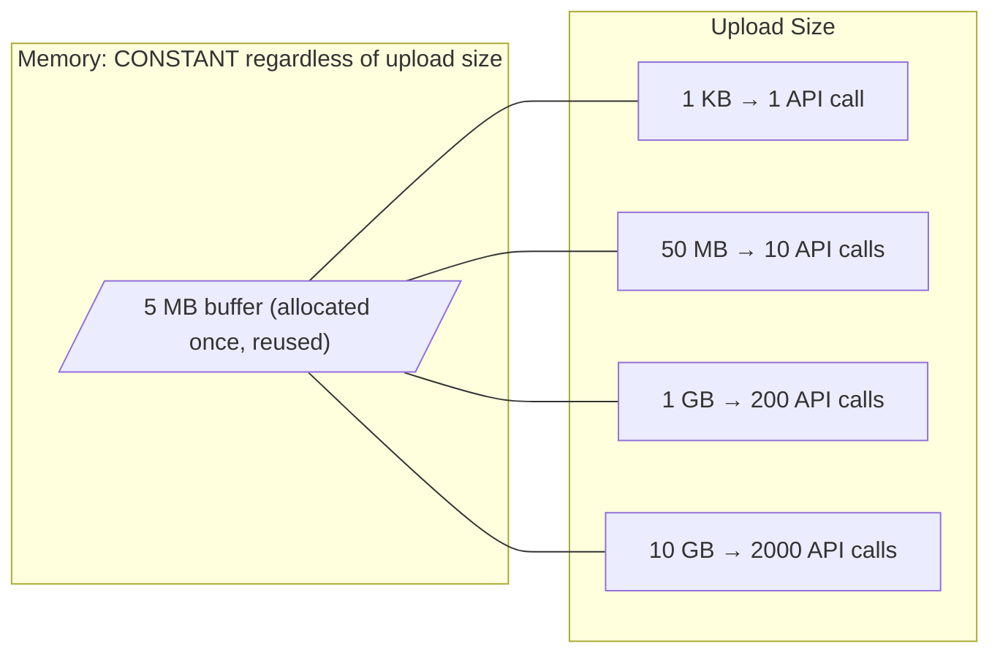
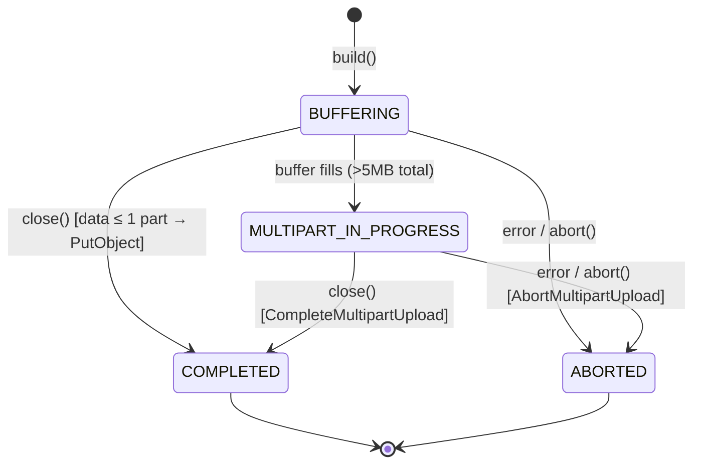

# S3 OutputStream

[](https://github.com/Arin016/s3-outputstream/actions/workflows/ci.yml)
[](https://openjdk.org/)
[](LICENSE)

A `java.io.OutputStream` that writes directly to S3 via multipart upload. Fixed 5 MB of memory whether you're uploading 1 KB or 10 GB.

This exists because the AWS SDK for Java v2 doesn't have one. [They know.](https://github.com/aws/aws-sdk-java-v2/issues/3128) It's been an open request since 2022.

---

## The Problem

Every Java library that generates output gives you an `OutputStream`:

```java
workbook.write(outputStream);      // Apache POI
document.save(outputStream);       // PDFBox
new ZipOutputStream(outputStream); // JDK
```

But S3 wants `byte[]` or `InputStream` with known length. No OutputStream. So you're stuck with:







---

## Usage

```java
try (S3OutputStream out = S3OutputStream.builder()
        .s3Client(s3Client)
        .bucket("my-bucket")
        .key("exports/report.xlsx")
        .build()) {

    workbook.write(out);  // streams to S3. 5 MB peak heap. done.
}
```

It's a standard `OutputStream`. Wrap it in `ZipOutputStream`, `GZIPOutputStream`, whatever.

---

## How It Works



**Small file optimization:** if total data never exceeds one part, skips multipart entirely → single `PutObject`. No overhead for small writes.

**On any failure:**



---

## Architecture



**Why the Strategy pattern?** Unit tests run in <100ms with zero network I/O. Swap in a recording implementation, test all buffering/state logic in isolation. The S3 SDK is never mocked.

---

## Memory Guarantee



| Upload size | Heap used | S3 API calls |
|-------------|-----------|--------------|
| 100 bytes   | 5 MB      | 1 (PutObject) |
| 50 MB       | 5 MB      | 10 + complete |
| 1 GB        | 5 MB      | 200 + complete |
| 10 GB       | 5 MB      | 2,000 + complete |

The buffer is **reused** — one allocation for the stream's entire lifetime. Released on `close()`.

---

## State Machine



Four states. No boolean soup. Illegal transitions are compile-time impossible.

---

## Examples

### Stream a ZIP to S3

```java
try (S3OutputStream s3Out = S3OutputStream.builder()
        .s3Client(s3).bucket("data").key("export.zip").build();
     ZipOutputStream zip = new ZipOutputStream(s3Out)) {

    for (Path file : filesToArchive) {
        zip.putNextEntry(new ZipEntry(file.getFileName().toString()));
        Files.copy(file, zip);
        zip.closeEntry();
    }
}
// ZIP in S3. Peak memory: 5 MB. Archive size: doesn't matter.
```

### Stream an Excel workbook (Apache POI)

```java
try (S3OutputStream out = S3OutputStream.builder()
        .s3Client(s3).bucket("reports").key("Q4.xlsx").build()) {

    SXSSFWorkbook workbook = generateLargeReport(); // 500K rows
    workbook.write(out);
    workbook.dispose();
}
```

### Custom part size

```java
// 50 MB parts: fewer API calls, more memory
S3OutputStream.builder()
    .s3Client(s3).bucket("b").key("k")
    .partSize(50 * 1024 * 1024)
    .build();
```

---

## What This Handles That Ad-Hoc Implementations Usually Don't

| Concern | This library | Typical DIY wrapper |
|---------|-------------|-------------------|
| Abort on failure | ✓ Auto-aborts, no orphaned parts | ✗ Often forgotten → silent S3 costs |
| Small file optimization | ✓ Single PutObject if ≤ 1 part | ✗ Always multipart (3 API calls for 100 bytes) |
| Write-after-close | ✓ Throws immediately | ✗ Silently drops bytes or NPE |
| Idempotent close | ✓ Safe to call twice | ✗ Double-complete or NPE |
| Buffer reuse | ✓ Zero GC pressure | ✗ New byte[] per part |
| Testable without S3 | ✓ Strategy pattern | ✗ Needs LocalStack or mocking |

---

## Installation

```xml
<dependency>
    <groupId>io.github.arinmallanna</groupId>
    <artifactId>s3-outputstream</artifactId>
    <version>1.0.0</version>
</dependency>
```

Requires `software.amazon.awssdk:s3` on your classpath (`provided` scope — bring your own version).

## Building & Testing

```bash
./mvnw verify          # 20 unit tests, <100ms, zero network
```

Integration test (real S3):
```bash
S3_TEST_BUCKET=your-bucket AWS_PROFILE=your-profile \
  java -ea -cp "target/classes:target/test-classes:$(./mvnw dependency:build-classpath -q -Dmdep.outputFile=/dev/stdout)" \
  io.github.arinmallanna.s3outputstream.S3OutputStreamIntegrationTest
```

---

## Background

I built this while designing a production export pipeline that streams 500K+ row Excel reports directly to S3 as ZIPs — maintaining ~7 MB peak memory for multi-GB exports (5 MB write buffer + 2 MB read buffer for streaming source data into the ZIP). The pipeline handles 4 concurrent exports on a single 4 GB pod across 300+ enterprise tenants.

The AWS SDK's `BlockingOutputStreamAsyncRequestBody` exists for the async client but requires different threading semantics. A synchronous `S3OutputStream` for the sync client — which most Java backends use — is [genuinely missing](https://github.com/aws/aws-sdk-java-v2/issues/3128).

## License

Apache 2.0
