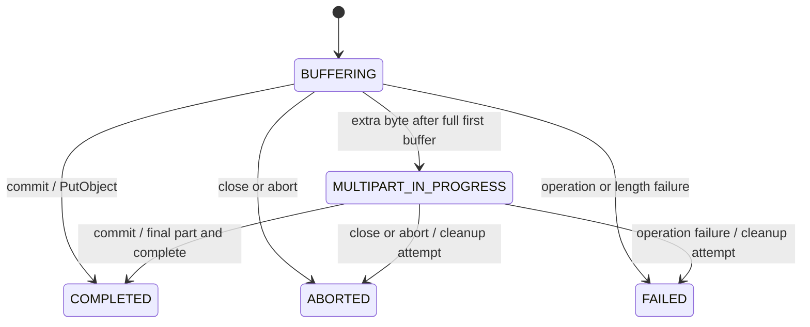
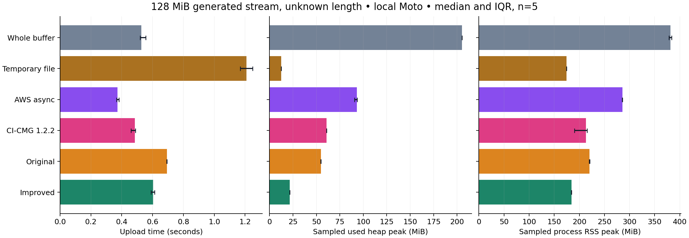

# An S3 OutputStream needs a success signal

*Engineering article, revised 10 September 2026 to incorporate the 9 September real-S3 conformance result. Author-reviewed by Arin Mallanna Tumbagi; unreleased and unpublished.*

A failed export can leave a successful S3 object. The original version of
`s3-outputstream`, at commit `939f2bd`, made this possible by completing uploads
inside `close()`:

```java
try (S3OutputStream out = configuredBuilder.build()) {
    generateReport(out); // throws after writing some bytes
} // historical close() could publish those bytes
```

Java calls `close()` on both normal and exceptional exits from this block. The
stream cannot tell which exit occurred. If report generation throws after writing
a prefix, completing the upload during cleanup declares that prefix to be the
finished object. Storage has succeeded while the application has failed.

Two failing regression tests reproduced this behavior before the implementation
changed. The new default separates the two decisions: `commit()` publishes;
`close()` aborts an uncommitted upload. With that contract, the direct form is:

```java
try (S3OutputStream out = configuredBuilder.build()) {
    generateReport(out);
    out.commit();
}
```

The [lifecycle decision record](decisions/0001-explicit-completion.md) explains the
compatibility choice. The rest of this article follows its consequences through
producer composition, buffer ownership, failure handling and a local comparison
with five alternatives.

## Let the producer finish before committing

Compression adds another ownership issue. A ZIP needs its final directory before
it is a complete artifact; closing the ZIP usually closes its destination. The
callback helper supplies a close-shielded view, allowing the producer to finish
its wrappers before the helper commits:

```java
S3OutputStream.upload(S3OutputStream.builder()
        .s3Client(s3)
        .bucket(destinationBucket)
        .key(destinationKey)
        .contentType("application/zip"), out -> {
    try (ZipOutputStream zip = new ZipOutputStream(out)) {
        zip.putNextEntry(new ZipEntry("data.csv"));
        writeCsv(zip);
        zip.closeEntry();
    }
});
```

Here `writeCsv` is the application's producer. The caller supplies and owns the
S3 client. A [complete ZIP example](../examples/UploadZip.java) includes imports
and an implementation that copies local files into the archive.

A normal callback return declares success. The producer must propagate errors,
finish its wrappers, and finish all writes before returning. Swallowing an error
or writing asynchronously after return violates that contract. The helper prevents
producer-side wrapper close from committing, but it cannot infer whether arbitrary
application output is semantically complete.

For migration, `autoCommitOnClose(true)` deliberately restores the historical
behavior and its producer-failure risk. The recommended helper always forces
explicit completion, even when passed a builder configured for legacy behavior.
These are breaking API semantics, documented in the [migration guide](migration.md).

Explicit success is an established design option. [CI-CMG's S3 OutputStream](https://github.com/CI-CMG/aws-s3-outputstream)
already documents the exception-on-close hazard and provides
`autoComplete(false)` / `done()`. This candidate makes explicit completion the
default and adds a producer view whose close cannot commit the upload.

## The state machine and the boundary byte

S3 multipart upload has its own completion operation: uploading parts does not
by itself publish their assembled final object. That gives the stream a place
to express success after production ends. Incomplete parts still require cleanup
if production fails. [AWS multipart lifecycle](https://docs.aws.amazon.com/AmazonS3/latest/userguide/mpuoverview.html)

The stream begins in `BUFFERING`. For a configured part size `P`, it retains the
first full buffer until another nonempty write arrives. An object whose final size
is at most `P`, including an empty object, therefore uses one `PutObject` at commit.
An additional byte starts multipart upload and sends the first full part.

Subsequent uploads are serial. The writing thread waits for a part to finish before
reusing its buffer, providing backpressure without an executor or queue. `flush()`
checks that the stream remains open; it does not publish the object or send a
partial part that might later become an invalid non-final part.



Terminal transitions release the stream's payload buffer, upload ID and receipt
list. Scalar counters remain available. A retained receipt snapshot belongs to
its caller. Releasing references allows reclamation; it does not promise an
immediate collection or zero GC activity.

A successful commit is idempotent. An aborted or failed stream cannot commit.
Repeated close or abort calls do nothing after termination; a failed cleanup is
reported rather than retried by another close. If uploading and aborting both
fail, the upload failure stays primary and the cleanup error is suppressed.
Try-with-resources similarly preserves a producer exception when close also fails.

The state records what this process observed. A lost completion response can leave
a final object even though the stream reports `FAILED`. A local integration test
deliberately executes completion, drops its success response, and verifies that
outcome. Abort cannot undo the final object. Applications needing stronger workflow
guarantees must reconcile ambiguous outcomes and manage their publication protocol.
An `ABORTED` state likewise records a local decision, not proof that remote cleanup
succeeded. The stream never deletes a final object.

## A fixed buffer has a fixed capacity

S3 permits 10,000 multipart parts, with a minimum non-final part size of 5 MiB.
With a fixed 5 MiB policy, the stream's capacity is exactly 52,428,800,000 bytes,
or 48.828125 GiB. It is not unlimited. [AWS multipart limits](https://docs.aws.amazon.com/AmazonS3/latest/userguide/qfacts.html)

For a known exact serialized length, `expectedLength(...)` selects a sufficient
part size before allocating the buffer: at least `ceil(length / 10000)` bytes,
subject to the 5 MiB minimum. An explicitly chosen insufficient size is rejected.
Overrun during writing and underrun at commit are fatal. A row count, estimate or
uncompressed ZIP input size is not the exact serialized output length.

This implementation uses one Java array, so its maximum part-size setting is
`Integer.MAX_VALUE - 8` bytes. Even a valid setting must fit the available heap.
Larger supported objects require a larger buffer chosen before writing begins.

Unknown-length streams enforce their configured capacity before accepting an
overflowing write call. Tests exercise 10,000 successful tiny test parts and reject
the next part, while separate arithmetic tests cover large lengths without huge
allocations. This is boundary testing, not a claim to have uploaded a 49 GiB object.

The library owns one reusable `P`-byte payload buffer, plus bounded part receipts
and small state. Its synchronous request body can replay the valid prefix of that
buffer for an SDK retry. Reuse happens only after the synchronous call returns.

That excludes the producer, compression buffers, AWS SDK, HTTP transport, thread
stacks, JIT, direct memory and other concurrent uploads. Process RSS and used JVM
heap answer different questions from “how many payload bytes does this stream
retain?” A small part buffer does not make an entire export a 5 or 7 MiB process.

An Excel producer adds its own constraints. POI's `SXSSFWorkbook` writes to an
`OutputStream`; it does not require the entire serialized workbook to be put in a
`ByteArrayOutputStream` first. Its row window, temporary files, comments, merged
regions and optional shared-string table still affect resource use. That is a
separate producer budget, not a property established by this SDK's byte-stream
benchmark. [POI SXSSFWorkbook documentation](https://poi.apache.org/apidocs/dev/org/apache/poi/xssf/streaming/SXSSFWorkbook.html)

## Measuring credible alternatives

Whole-object buffering remains a reasonable baseline for small, bounded output.
The comparison uses a replayable view of its buffer, avoiding extra full-object
copies. Temporary-file staging pays disk and I/O costs but gives upload a
replayable source after production has succeeded. Both separate generation from
publication without keeping a multipart session open during generation.

The comparison runs six adapters: efficient whole-object buffering, temporary-file
staging, AWS's blocking-output async request body, CI-CMG 1.2.2, unchanged original
source at `939f2bd`, and the improved serial stream. All use AWS SDK 2.47.3.
Original source is loaded separately against the same SDK, so this comparison is
not a replay of its historical dependency environment.

The AWS adapter uses its existing
[`BlockingOutputStreamAsyncRequestBody`](https://docs.aws.amazon.com/java/api/latest/software/amazon/awssdk/core/async/BlockingOutputStreamAsyncRequestBody.html)
with multipart explicitly enabled, four HTTP connections and a four-part API
buffer. CI-CMG uses a queue of one and its explicit success option. Original and
improved serial implementations use 5 MiB parts in the comparison below; the
producer writes 64 KiB chunks. Full settings and variants are in the
[measurement protocol](benchmark-protocol.md).

The original success sweep contains 17 scenarios, 102 fresh JVM blocks, and 714 raw
runs: two warmups followed by five measured repetitions per block. It covers
empty/boundary objects, generated data through 128 MiB, known/unknown lengths,
write granularity, part size, producer pacing, service delays and synthetic CSV
inside ZIP. Blocks use a recorded random order.

The host is macOS 26.1 arm64 with 24 GiB RAM and 12 reported logical CPUs. Java is
Corretto 21.0.10, with a 128 MiB initial and 512 MiB maximum heap and G1. The service
is Moto 5.1.12 on loopback HTTP. Each upload is verified by final length and SHA-256;
verification and administrative cleanup are outside the timed upload interval.
The original sweep began on 5 September UTC and resumed on 6 September after a
session interruption, with source/POM hashes verified before resumption. The
recorded order and session break remain part of the evidence.

For the **128 MiB unknown-length generated stream**, the original sweep gives:

| Adapter | Seconds, median [Q1, Q3] | Sampled peak used heap MiB, median | Sampled peak RSS MiB, median |
|---|---:|---:|---:|
| Whole buffer | 0.53 [0.52, 0.56] | 205.33 | 381.20 |
| Temporary file | 1.21 [1.17, 1.25] | 12.40 | 174.30 |
| AWS async, raw blocking body | 0.37 [0.37, 0.38] | 93.20 | 285.84 |
| CI-CMG 1.2.2 | 0.49 [0.46, 0.49] | 60.70 | 213.39 |
| Original serial | 0.69 [0.69, 0.69] | 54.70 | 220.44 |
| Improved serial | 0.60 [0.59, 0.61] | 21.54 | 184.16 |

These are five measurements per adapter in one JVM block, not independent host
replications. The [summary CSV](evidence/success-summary.csv) supplies memory IQRs
and every scenario. Heap and RSS are sampled every 5 ms, so observed peaks are
lower bounds; RSS excludes the Python service. Client construction and a separate
expected-hash prepass are outside timing; generation and upload are inside it.
The experiment uses loopback HTTP without TLS or a remote network. It measures
this configured JVM/fixture system, not expected throughput to real S3.



*Historical September 5–6 sweep; five measurements per adapter. AWS here uses
the raw blocking body. The buffered-retry option is evaluated separately below.*

AWS async is faster here, while the improved serial stream has lower observed
heap and RSS. Temporary-file staging uses still less heap and pays for staging
time. The improved stream also shows lower observed heap than the original
serial source, but its time advantage does not hold across every case: at 32 MiB,
its median is slightly higher, with overlapping interquartile ranges.

With 64 MiB of synthetic CSV input serialized into ZIP, the improved stream used
92.47 MiB sampled peak heap and 221.25 MiB sampled RSS at the median. Producer and
compression work matter. Its 1.41 second median was similar to the original's
1.41 seconds; swapping the sink did not remove the producer's cost. ZIP throughput
in the raw data uses the final compressed object size, about 15.7 MiB, rather
than its input size. This workload is synthetic CSV and ZIP, not an Excel export.

Two unsuccessful configurations remain visible. CI-CMG's empty-object path sent
a zero-part completion that Moto rejected. The AWS known-length HTTP case initially
failed because chunked signing had been disabled. Re-enabling it produced correct
uploads; a separate corrected supplement repeats the relevant comparisons. The
initial AWS block diagnoses a harness configuration problem. Of 510 measured
rows in the main sweep, 500 are correct successes; the unsuccessful rows remain
in the [archived error table](evidence/unsuccessful-runs.csv). Performance summaries
use only correct successes, and the signing supplement stays separate.

## Retry and cleanup change the comparison

An output stream consumes bytes as the producer supplies them. Retrying a request
requires access to those bytes again. The synchronous implementation keeps its
part buffer unchanged until the SDK call returns, allowing a fresh read of the
same valid prefix on retry. The raw AWS blocking body did not successfully
resubscribe after the injected transient part error in this experiment.

AWS SDK 2.47.3 also provides `BufferedSplittableAsyncRequestBody`. In a separate
supplement, the [benchmark adapter](../src/benchmark/java/io/github/arinmallanna/s3outputstream/BenchmarkMain.java)
wrapped the blocking body with `bufferBeforeSend(true)`, retaining the same
four-part API buffer. In three fresh JVM forks with a transient part HTTP 503 and
two permitted retries, both the improved serial stream and this buffered AWS
option produced correct objects in all three forks. The raw AWS body failed all
three. The relevant API distinction is replayability; AWS already supplies a
retry-capable option. [Raw-body fault results](evidence/failure-summary.csv),
[buffered-body fault results](evidence/aws-retry-failure-summary.csv)

That option needs its own performance observation. In the historical 128 MiB
unknown-length success supplement, under the same host/JVM/fixture settings,
the buffered AWS body measured 0.46 s [0.36, 0.54], with median sampled peak heap
140.37 MiB and RSS 355.95 MiB. There were two warmups and five measurements.
The spread and memory footprint belong to this configuration; its rows are not
pooled into the raw-body table. [Buffered-retry success data](evidence/aws-retry-success-summary.csv)

The final fault comparison targets 12 MiB generated objects and uses three fresh
JVMs per adapter/scenario. Producer errors occur after 1 KiB or 6 MiB, bracketing
multipart initiation. The most useful observations are about publication and
cleanup, not throughput:

| Injected failure | Observed outcome in the final local runs |
|---|---|
| Producer stops before or after multipart begins | Original close publishes a partial object in all three forks at each position. Improved, whole-buffer, temporary-file, CI-CMG and both AWS configurations leave no final object in those tested cases. |
| Part upload and abort both fail | Improved, original serial and both AWS configurations each leave one unfinished multipart upload per fork. CI-CMG times out in all three forks. |
| Part upload fails permanently | CI-CMG times out in all three forks. Object visibility for those runs is unknown. |
| Completion fails | CI-CMG leaves one unfinished multipart upload per fork; improved and both AWS configurations leave none in these observations. |

The original close behavior is the intentionally preserved historical baseline;
the other adapters use their available explicit success/cancellation protocols.
Whole-buffer and temporary-file adapters upload with single PUTs, so multipart
operation faults do not exercise them. Their completed objects in those scenarios
are not a reliability advantage.

One harness defect mattered here: resetting faults immediately after the upload
future failed could let a delayed async abort succeed. The final sweeps keep
faults active through object/orphan inspection and reset them only for
administrative cleanup. Earlier sweeps remain diagnostic evidence. Six CI-CMG
timeouts ended with fixture destruction; their missing visibility results are
reported as unknown. A test harness removing an orphan establishes nothing about
whether the adapter removed it. [Full report and raw evidence](benchmark-results.md)

## Using the candidate

After measurement, advisory review prompted transport updates to Netty
4.1.137.Final, HttpClient 5.6.3 and HttpCore 5.4.3, retaining AWS SDK 2.47.3. Clean
local builds passed 75 unit and 16 Moto integration invocations on each of Java
11, 17 and 21, including strict Javadocs and package inspection. The September 7
OSV lookup returned no advisory matches for the 60 checked Maven packages; that
is a dated lookup result, not a security guarantee. S3 remains a provided
dependency, so consuming applications manage their own SDK and HTTP versions.
[Release and dependency evidence](release.md)

The updated transports received separate validation. In that later 128 MiB
unknown-length case, with the same workload/host/JVM/fixture settings and five
measurements per adapter, the
original and improved serial median times were 0.61 s [0.60, 0.61] and
0.60 s [0.59, 0.61], respectively. All six adapters passed their success blocks;
the buffered AWS option also passed known/unknown-length checks and the repeated
fault scenarios produced the documented retry and cleanup outcomes. The closer
serial timings reinforce the need to measure a workload instead of promising a
general speedup. [Post-update results](benchmark-results.md#post-update-transport-checks)

Use the synchronous stream when sequential producers, a small explicit payload
buffer and a direct failure path are a good fit. Whole buffering remains attractive
for bounded small objects. Temporary files are useful when staging and replay are
more important than avoiding disk. An async SDK path can overlap generation and
requests when its memory and cancellation contract fit the application.

For a local trial, follow the [build instructions](../README.md#build-test-and-evaluate-locally)
and [benchmark commands](../tools/benchmarks/README.md). The
[evidence bundle](evidence/s3-outputstream-local-evidence-20260908.tar.gz) retains
raw rows, failures, diagnostics, source snapshots and per-JDK verification reports.
Its index distinguishes original hashes from bytes redacted for the review copy.

This candidate has no parallel parts, adaptive sizing, crash recovery or resumable
session API. The stream and builder are not thread-safe. Configure client timeouts
and retries, and arrange lifecycle cleanup for abandoned multipart uploads.
Interruption checks cannot forcibly cancel an arbitrary synchronous HTTP call.
If downstream consumers must never discover an object after an ambiguous commit,
the application needs a separate publication/reconciliation protocol; this stream
alone cannot provide it. Real-S3 conformance was verified on 9 September 2026;
public release remains a separate step.

The guarded real-S3 program passed against AWS S3 for deterministic 0-byte,
1 KiB and 11 MiB objects, verifying exact length, SHA-256 integrity, object cleanup
and multipart cleanup. The destination-free, commit-bound
[receipt](../evidence/real-s3/2026-09-09/receipt.json) records tested source
`f635e05`. This is bounded protocol conformance, not a performance, availability
or adoption claim.

*Provenance: the original repository is Arin Mallanna Tumbagi's public project.
The September 2026 hardening, evaluation and article preparation were AI-assisted
with Codex. This article describes repository behavior, synthetic local
experiments and the bounded real-S3 conformance run above; it does not establish
production use or an internal-system lineage.
Author review completed 10 September 2026.*
