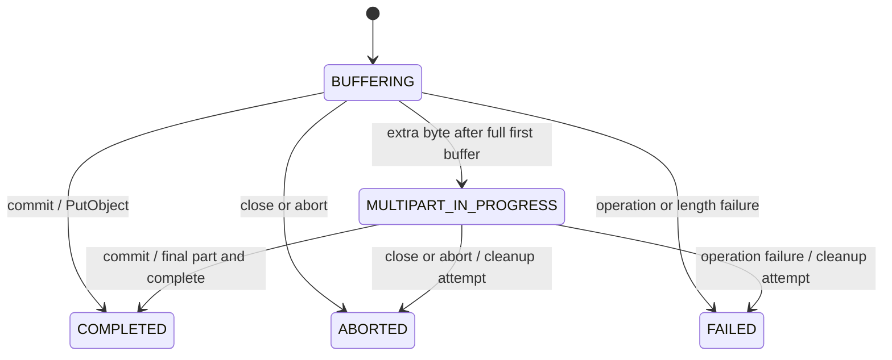

# An S3 OutputStream needs a success signal

*Engineering article draft, 6 September 2026. Describes the local, unreleased
2.0.0-SNAPSHOT candidate. Publication and final author review are pending.*

A producer that accepts a Java `OutputStream` is easy to compose with a file,
a compressor or an HTTP response. Uploading that producer's output to S3 requires
another decision: when is the object complete, and who is allowed to declare it so?

That question exposed the most consequential bug in the original
[s3-outputstream implementation](../src/main/java/io/github/arinmallanna/s3outputstream/S3OutputStream.java).
The stream completed its upload in `close()`. Java also calls `close()` when the
producer throws inside a try-with-resources block. A failed export could therefore
leave a successfully published prefix of the intended object.

The hardened version makes success explicit. `commit()` publishes; the default
`close()` aborts an uncommitted upload. This article explains that contract, its
limits, and a reproducible local comparison with five alternatives.

## Connecting the producer to storage

Whole-object buffering is a reasonable choice for small, bounded output. Generate
into a byte buffer, determine its length, and upload it. An efficient implementation
can expose a replayable view of that buffer without making additional full-size
copies. The trade-off remains proportional payload memory, plus any buffer-growth
and runtime overhead.

A temporary file moves staging to disk. It separates production from upload and
provides a replayable source after generation succeeds. It also adds disk space,
I/O and file lifecycle management. Those costs can be entirely acceptable.

Streaming multipart upload trades that staging for a protocol and an active
session. Numbered parts are acknowledged individually; completion assembles the
final object. A failed producer must terminate that session without declaring its
partial output successful. Incomplete parts can remain stored if cleanup fails or
the process dies. [AWS multipart lifecycle documentation](https://docs.aws.amazon.com/AmazonS3/latest/userguide/mpuoverview.html)

This composition pattern already exists. AWS offers
[`BlockingOutputStreamAsyncRequestBody`](https://docs.aws.amazon.com/java/api/latest/software/amazon/awssdk/core/async/BlockingOutputStreamAsyncRequestBody.html),
and [CI-CMG's library](https://github.com/CI-CMG/aws-s3-outputstream) provides queued
upload and an explicit `autoComplete(false)` / `done()` contract. The value of this
project is a compact synchronous API with inspectable failure semantics, rather
than a claim to have invented streaming to S3.

## Closing is not proof of successful production

The original contract made this code unsafe:

```java
try (S3OutputStream out = configuredBuilder.build()) {
    generateReport(out); // throws after writing some bytes
} // historical close() could publish those bytes
```

Regression tests reproduced partial publication before the implementation changed.
With the new default, the direct form is:

```java
try (S3OutputStream out = configuredBuilder.build()) {
    generateReport(out);
    out.commit();
}
```

Compression adds another ownership issue. A ZIP needs its final directory before
it is a complete artifact; closing the ZIP usually closes its destination. The
callback helper supplies a close-shielded view, allowing the producer to finish
its wrappers before the helper commits:

```java
S3OutputStream.upload(configuredBuilder.contentType("application/zip"), out -> {
    try (ZipOutputStream zip = new ZipOutputStream(out)) {
        zip.putNextEntry(new ZipEntry("data.csv"));
        writeCsv(zip);
        zip.closeEntry();
    }
});
```

A normal callback return declares success. The producer must propagate errors,
finish its wrappers, and finish all writes before returning. Swallowing an error
or writing asynchronously after return violates that contract. The helper prevents
producer-side wrapper close from committing, but it cannot infer whether arbitrary
application output is semantically complete.

For migration, `autoCommitOnClose(true)` deliberately restores the historical
behavior and its producer-failure risk. The recommended helper always forces
explicit completion, even when passed a builder configured for legacy behavior.

## The state machine and the boundary byte

The stream begins in `BUFFERING`. For a configured part size `P`, it retains the
first full buffer until another nonempty write arrives. An object whose final size
is at most `P`, including an empty object, therefore uses one `PutObject` at commit.
An additional byte starts multipart upload and sends the first full part.

Subsequent uploads are serial. The writing thread waits for a part to finish before
reusing its buffer, providing backpressure without an executor or queue. `flush()`
checks that the stream remains open; it does not publish the object or send a
partial part that might later become an invalid non-final part.



Terminal transitions release the stream's payload buffer, upload ID and receipt
list. Scalar counters remain available. A retained receipt snapshot belongs to
its caller. Releasing references allows reclamation; it does not promise an
immediate collection or zero GC activity.

A successful commit is idempotent. An aborted or failed stream cannot commit.
Abort and close perform at most the intended single cleanup attempt after a
terminal transition. If uploading and aborting both fail, the upload failure stays
primary and the cleanup error is suppressed. Try-with-resources similarly preserves
a producer exception when close also fails.

The state records what this process observed. A lost completion response can leave
a final object even though the stream reports `FAILED`. A local integration test
deliberately executes completion, drops its success response, and verifies that
outcome. Abort cannot undo the final object. Applications needing stronger workflow
guarantees must reconcile ambiguous outcomes and manage their publication protocol.

## A fixed buffer has a fixed capacity

S3 permits 10,000 multipart parts, with a minimum non-final part size of 5 MiB.
With a fixed 5 MiB policy, the stream's capacity is exactly 52,428,800,000 bytes,
or 48.828125 GiB. It is not unlimited. [AWS multipart limits](https://docs.aws.amazon.com/AmazonS3/latest/userguide/qfacts.html)

For a known exact serialized length, `expectedLength(...)` selects a sufficient
part size before allocating the buffer. An explicitly chosen insufficient size is
rejected. Overrun during writing and underrun at commit are fatal. The uncompressed
input size of a ZIP is not its exact serialized output length.

Unknown-length streams enforce their configured capacity before accepting an
overflowing write call. Tests exercise 10,000 successful tiny test parts and reject
the next part, while separate arithmetic tests cover large lengths without huge
allocations. This is boundary testing, not a claim to have uploaded a 49 GiB object.

## What the buffer bound actually means

The library owns one reusable `P`-byte payload buffer, plus bounded part receipts
and small state. Its synchronous request body can replay the valid prefix of that
buffer for an SDK retry. Reuse happens only after the synchronous call returns.

That excludes the producer, compression buffers, AWS SDK, HTTP transport, thread
stacks, JIT, direct memory and other concurrent uploads. Process RSS and used JVM
heap answer different questions from “how many payload bytes does this stream
retain?” A small part buffer does not make an entire export a 5 or 7 MiB process.

An Excel producer adds its own constraints. POI's `SXSSFWorkbook` writes to an
`OutputStream`; it does not require the entire serialized workbook to be put in a
`ByteArrayOutputStream` first. Its row window, temporary files, comments, merged
regions and optional shared-string table still affect resource use. That is a
separate producer budget, not a property established by this SDK's byte-stream
benchmark. [POI SXSSFWorkbook documentation](https://poi.apache.org/apidocs/dev/org/apache/poi/xssf/streaming/SXSSFWorkbook.html)

## Measuring credible alternatives

The comparison runs six adapters: efficient whole-object buffering, temporary-file
staging, AWS's blocking-output async request body, CI-CMG 1.2.2, unchanged original
source at `939f2bd`, and the improved serial stream. All use AWS SDK 2.47.3.
Original source is loaded separately against the same SDK, so this comparison is
not a replay of its historical dependency environment.

The original success sweep contains 17 scenarios, 102 fresh JVM blocks, and 714 raw
runs: two warmups followed by five measured repetitions per block. It covers
empty/boundary objects, generated data through 128 MiB, known/unknown lengths,
write granularity, part size, producer pacing, service delays and synthetic CSV
inside ZIP. Blocks use a recorded random order.

The host is macOS 26.1 arm64 with 24 GiB RAM and 12 reported logical CPUs. Java is
Corretto 21.0.10, with a 128 MiB initial and 512 MiB maximum heap and G1. The service
is Moto 5.1.12 on loopback HTTP. Each upload is verified by final length and SHA-256;
verification and administrative cleanup are outside the timed upload interval.
The original sweep began on 5 September UTC, resumed on 6 September after a session
interruption, and preserves that break in its evidence.

For the **128 MiB unknown-length generated stream**, the original sweep gives:

| Adapter | Seconds, median [Q1, Q3] | Sampled used heap MiB, median | Sampled RSS MiB, median |
|---|---:|---:|---:|
| Whole buffer | 0.53 [0.52, 0.56] | 205.33 | 381.20 |
| Temporary file | 1.21 [1.17, 1.25] | 12.40 | 174.30 |
| AWS async | 0.37 [0.37, 0.38] | 93.20 | 285.84 |
| CI-CMG 1.2.2 | 0.49 [0.46, 0.49] | 60.70 | 213.39 |
| Original serial | 0.69 [0.69, 0.69] | 54.70 | 220.44 |
| Improved serial | 0.60 [0.59, 0.61] | 21.54 | 184.16 |

These are five measurements per adapter in one JVM block, not independent host
replications. The [generated report](benchmark-results.md) includes IQRs for
memory, raw provenance and every scenario. Sampled peaks are observed lower bounds;
RSS excludes the Python service. Client construction is outside timing.


The async adapter is faster here, with additional observed memory. The improved
serial stream reduces observed heap relative to the original while retaining the
synchronous contract. That is useful evidence for a trade-off, not a universal
ranking. At 32 MiB, the improved stream's median time was slightly higher than the
original's, with overlapping interquartile ranges.

With 64 MiB of synthetic CSV input serialized into ZIP, the improved stream used
92.47 MiB sampled peak heap and 221.25 MiB sampled RSS at the median. Producer and
compression work matter. Its 1.41 second median was similar to the original's
1.41 seconds; swapping the sink did not remove the producer's cost. ZIP throughput
in the raw data uses the final compressed object size, not the input size.

Two unsuccessful configurations remain visible. CI-CMG's empty-object path sent
a zero-part completion that Moto rejected. The AWS known-length HTTP case initially
failed because chunked signing had been disabled. Re-enabling it produced correct
uploads; a separate corrected supplement repeats the relevant comparisons. The
initial AWS block is a harness configuration issue, not evidence that AWS cannot
upload known-length output. Neither case becomes a throughput observation.

Failure experiments use three fresh JVMs per adapter/scenario and preserve
exceptions, partial objects, orphan uploads and timeouts. Multipart-operation
faults do not exercise adapters that use only `PutObject`. A terminated fixture
after a hung process is harness cleanup, not proof that the adapter cleaned up.
The [report](benchmark-results.md) distinguishes these outcomes.

## Where this implementation fits

Use the synchronous stream when sequential producers, a small explicit payload
buffer and a direct failure path are a good fit. Whole buffering remains attractive
for bounded small objects. Temporary files are useful when staging and replay are
more important than avoiding disk. An async SDK path can overlap generation and
requests when its memory and cancellation contract fit the application.

This candidate does not provide parallel parts, adaptive sizing, crash recovery,
resumability, or a general distributed transaction. Client timeouts/retries and
incomplete-multipart lifecycle rules remain operational responsibilities. Local
Moto tests establish specific wire and lifecycle behavior; real-S3 validation and
public release remain separate steps.

The engineering result is a stronger success contract, documented resource limits,
tested failure behavior, and a comparison that also records where alternatives
perform better. The reproduction commands, migration notes and release checklist
are part of the artifact. No research-paper claim is needed to explain its value.
