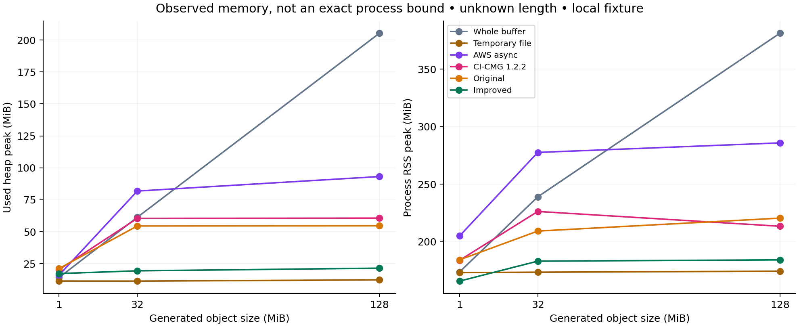

# Benchmark evidence and interpretation

This is a local review report, assembled September 8, 2026. Historical experiments
ran September 5–6; patched-transport checks ran September 7. Read the
[protocol](benchmark-protocol.md) and [reproduction instructions](../tools/benchmarks/README.md).
The [registry](evidence/BENCHMARK_REGISTRY.csv) records inclusion rules, source/POM
identities, environment and raw hashes. The [claim ledger](evidence/CLAIMS_EVIDENCE.csv)
defines allowed wording and its limits.

The host was macOS 26.1 arm64, 24 GiB RAM and 12 reported logical CPUs, using
Corretto 21.0.10, G1, -Xms128m and -Xmx512m. The service was Moto 5.1.12 over
loopback HTTP. Default parts were 5 MiB and producer writes 64 KiB. AWS async used
four HTTP connections and a four-part API buffer; CI-CMG 1.2.2 used a queue of one.
Exact per-case variations are in the archived protocol. These were single-host
experiments with no real-S3 traffic, TLS or geographically remote network.

The [review bundle](evidence/s3-outputstream-local-evidence-20260908.tar.gz)
contains raw rows, diagnostics, matrix reports, source snapshots, generated tables
and an index of hashes. Its checksum is recorded in the adjacent `.sha256` file.
It is a local artifact, not a publication receipt. Source snapshots preserve all
selected executable inputs; some intermediate untracked README bytes are unavailable
and explicitly recorded. Home paths and fixture ports are redacted in the bundle.

The bundle was frozen before the final article-writing pass; its writing-status
metadata is historical. Current article status and validation are in
[ARTICLE_REVIEW.md](ARTICLE_REVIEW.md), with the current claim ledger alongside
this report. Raw measurements and the archive checksum remain unchanged.

Interpretation matters:

- The original success sweep has 714 rows, including 204 warmups and 510 measured
  rows. Of the measured rows, 500 were correct successes. An invalid AWS signing
  configuration and a CI-CMG empty-object failure remain visible and excluded from
  performance distributions. The corrected signing supplement is separate.
- Each success distribution is five sequential measurements in one JVM after two
  warmups. The main run resumed after a desktop interruption with verified source
  hashes; shared-host load remains a limitation. Do not infer significance or a
  universal ranking from its interquartile ranges.
- The unwrapped AWS blocking body is one option. The buffered-retry supplement
  correctly replayed the transient part fault in all three forks; raw blocking
  output did not. Both configurations and their memory/time measurements remain
  visible. The improved serial stream is not presented as always faster.
- Final failure tables use faults held active through visibility inspection.
  Earlier fault sweeps reset them too soon and remain diagnostic only. Six CI-CMG
  timeouts have unknown visibility. No result means unknown, including blank CSV
  visibility/cleanup fields; it never means a clean object store.
- Whole-buffer and temporary-file adapters use single PUTs; multipart failures
  are unexercised there. Orphans are counted before administrative cleanup.
  Abort failure, crashes and lost completion responses prevent universal cleanup
  or remote absence guarantees.

Historical transports include advisory matches recorded after measurement. Their
versions are frozen as evidence identities. The separate September 7 section uses
updated transports; see the [release dependency policy](release.md#dependency-policy-and-advisory-review).

# Historical local benchmark results

Generated from archived raw rows. Performance tables include only hash-correct successful uploads.
Each cell is the median and inclusive interquartile range of five measured repetitions in one JVM block.
This is a single-host loopback experiment with Moto 5.1.12 and AWS SDK 2.47.3, not real-S3 evidence.
Heap/RSS are sampled lower bounds; RSS excludes the service. Empty objects have zero byte-throughput.

Archived success rows: 714; measured: 510; unsuccessful rows (including warmup): 14.

| Case | Adapter | Correct / measured | Seconds, median [Q1, Q3] | MiB/s | Peak used heap MiB | Peak RSS MiB |
|---|---|---:|---:|---:|---:|---:|
| 32m-unknown | whole-buffer | 5/5 | 0.12 [0.12, 0.13] | 258.02 [255.95, 258.37] | 61.32 [61.32, 61.32] | 238.95 [238.91, 239.02] |
| 32m-unknown | temp-file | 5/5 | 0.29 [0.29, 0.30] | 108.73 [108.05, 111.38] | 11.43 [11.43, 11.43] | 173.44 [173.33, 173.50] |
| 32m-unknown | aws-async | 5/5 | 0.11 [0.10, 0.11] | 298.25 [285.59, 328.42] | 81.86 [81.81, 82.66] | 277.55 [276.88, 278.28] |
| 32m-unknown | ci-cmg | 5/5 | 0.13 [0.13, 0.13] | 245.14 [243.09, 249.67] | 60.49 [60.48, 60.51] | 226.23 [225.95, 226.66] |
| 32m-unknown | original-939f2bd | 5/5 | 0.17 [0.17, 0.19] | 187.80 [166.42, 188.98] | 54.55 [54.53, 54.57] | 209.19 [208.48, 209.59] |
| 32m-unknown | improved | 5/5 | 0.18 [0.16, 0.18] | 181.53 [179.42, 196.64] | 19.47 [18.45, 19.48] | 183.05 [182.83, 183.53] |
| 128m-unknown | whole-buffer | 5/5 | 0.53 [0.52, 0.56] | 242.91 [230.05, 246.68] | 205.33 [205.33, 205.33] | 381.20 [378.75, 383.59] |
| 128m-unknown | temp-file | 5/5 | 1.21 [1.17, 1.25] | 105.90 [102.47, 109.48] | 12.40 [12.39, 12.40] | 174.30 [174.19, 174.41] |
| 128m-unknown | aws-async | 5/5 | 0.37 [0.37, 0.38] | 344.43 [335.37, 348.24] | 93.20 [90.64, 93.45] | 285.84 [285.08, 286.09] |
| 128m-unknown | ci-cmg | 5/5 | 0.49 [0.46, 0.49] | 263.60 [261.80, 277.80] | 60.70 [60.70, 60.71] | 213.39 [190.25, 215.53] |
| 128m-unknown | original-939f2bd | 5/5 | 0.69 [0.69, 0.69] | 184.76 [184.48, 185.31] | 54.70 [54.69, 54.72] | 220.44 [219.89, 221.08] |
| 128m-unknown | improved | 5/5 | 0.60 [0.59, 0.61] | 212.04 [209.14, 216.93] | 21.54 [21.53, 21.54] | 184.16 [183.69, 184.72] |
| 128m-known | whole-buffer | 5/5 | 0.46 [0.45, 0.48] | 279.22 [264.70, 282.42] | 140.33 [140.33, 140.33] | 303.03 [302.94, 303.31] |
| 128m-known | temp-file | 5/5 | 1.28 [1.24, 1.30] | 100.19 [98.17, 103.48] | 12.43 [12.43, 12.43] | 172.69 [172.62, 172.75] |
| 128m-known | aws-async | 0/5 | NA | NA | NA | NA |
| 128m-known | ci-cmg | 5/5 | 0.50 [0.48, 0.50] | 256.52 [256.09, 265.84] | 60.66 [60.66, 60.67] | 228.27 [227.80, 229.61] |
| 128m-known | original-939f2bd | 5/5 | 0.65 [0.63, 0.68] | 197.59 [188.72, 202.22] | 54.70 [54.70, 54.71] | 221.50 [221.09, 222.16] |
| 128m-known | improved | 5/5 | 0.63 [0.63, 0.67] | 202.19 [191.80, 202.92] | 21.57 [21.56, 21.58] | 184.92 [184.45, 185.47] |
| 64m-zip-csv | whole-buffer | 5/5 | 1.35 [1.34, 1.40] | 11.63 [11.22, 11.67] | 111.51 [111.51, 111.52] | 248.67 [248.61, 248.75] |
| 64m-zip-csv | temp-file | 5/5 | 1.37 [1.37, 1.38] | 11.45 [11.33, 11.46] | 85.81 [85.76, 86.50] | 218.58 [218.48, 218.59] |
| 64m-zip-csv | aws-async | 5/5 | 1.39 [1.38, 1.39] | 11.31 [11.30, 11.32] | 97.60 [97.59, 97.89] | 293.98 [293.81, 294.27] |
| 64m-zip-csv | ci-cmg | 5/5 | 1.32 [1.32, 1.32] | 11.91 [11.88, 11.91] | 103.69 [103.66, 103.70] | 240.95 [240.84, 241.25] |
| 64m-zip-csv | original-939f2bd | 5/5 | 1.41 [1.41, 1.41] | 11.09 [11.09, 11.10] | 97.70 [97.68, 97.73] | 231.28 [231.17, 231.73] |
| 64m-zip-csv | improved | 5/5 | 1.41 [1.38, 1.44] | 11.13 [10.89, 11.32] | 92.47 [91.70, 92.49] | 221.25 [221.11, 221.66] |

All cases, request counts, CPU, GC, allocation and first-request distributions are in [success-summary.csv](evidence/success-summary.csv).
Allocation covers only the producer thread; GC collection time is not a pause-duration sum.
Raw errors and unsupported cases remain in [unsuccessful-runs.csv](evidence/unsuccessful-runs.csv) and the source evidence directories.

## Fault outcomes

| Case | Adapter | Forks | Timeouts | Full / partial / absent objects | Orphan uploads |
|---|---|---:|---:|---:|---:|
| complete-failure | aws-async | 3 | 0 | 0 / 0 / 3 | 0 |
| complete-failure | ci-cmg | 3 | 0 | 0 / 0 / 3 | 3 |
| complete-failure | improved | 3 | 0 | 0 / 0 / 3 | 0 |
| complete-failure | original-939f2bd | 3 | 0 | 0 / 0 / 3 | 0 |
| complete-failure | temp-file | 3 | 0 | 3 / 0 / 0 | 0 |
| complete-failure | whole-buffer | 3 | 0 | 3 / 0 / 0 | 0 |
| create-failure | aws-async | 3 | 0 | 0 / 0 / 3 | 0 |
| create-failure | ci-cmg | 3 | 0 | 0 / 0 / 3 | 0 |
| create-failure | improved | 3 | 0 | 0 / 0 / 3 | 0 |
| create-failure | original-939f2bd | 3 | 0 | 0 / 0 / 3 | 0 |
| create-failure | temp-file | 3 | 0 | 3 / 0 / 0 | 0 |
| create-failure | whole-buffer | 3 | 0 | 3 / 0 / 0 | 0 |
| part-and-abort-failure | aws-async | 3 | 0 | 0 / 0 / 3 | 3 |
| part-and-abort-failure | ci-cmg | 3 | 3 | NA (no result) | NA |
| part-and-abort-failure | improved | 3 | 0 | 0 / 0 / 3 | 3 |
| part-and-abort-failure | original-939f2bd | 3 | 0 | 0 / 0 / 3 | 3 |
| part-and-abort-failure | temp-file | 3 | 0 | 3 / 0 / 0 | 0 |
| part-and-abort-failure | whole-buffer | 3 | 0 | 3 / 0 / 0 | 0 |
| permanent-part | aws-async | 3 | 0 | 0 / 0 / 3 | 0 |
| permanent-part | ci-cmg | 3 | 3 | NA (no result) | NA |
| permanent-part | improved | 3 | 0 | 0 / 0 / 3 | 0 |
| permanent-part | original-939f2bd | 3 | 0 | 0 / 0 / 3 | 0 |
| permanent-part | temp-file | 3 | 0 | 3 / 0 / 0 | 0 |
| permanent-part | whole-buffer | 3 | 0 | 3 / 0 / 0 | 0 |
| producer-after-multipart | aws-async | 3 | 0 | 0 / 0 / 3 | 0 |
| producer-after-multipart | ci-cmg | 3 | 0 | 0 / 0 / 3 | 0 |
| producer-after-multipart | improved | 3 | 0 | 0 / 0 / 3 | 0 |
| producer-after-multipart | original-939f2bd | 3 | 0 | 0 / 3 / 0 | 0 |
| producer-after-multipart | temp-file | 3 | 0 | 0 / 0 / 3 | 0 |
| producer-after-multipart | whole-buffer | 3 | 0 | 0 / 0 / 3 | 0 |
| producer-before-multipart | aws-async | 3 | 0 | 0 / 0 / 3 | 0 |
| producer-before-multipart | ci-cmg | 3 | 0 | 0 / 0 / 3 | 0 |
| producer-before-multipart | improved | 3 | 0 | 0 / 0 / 3 | 0 |
| producer-before-multipart | original-939f2bd | 3 | 0 | 0 / 3 / 0 | 0 |
| producer-before-multipart | temp-file | 3 | 0 | 0 / 0 / 3 | 0 |
| producer-before-multipart | whole-buffer | 3 | 0 | 0 / 0 / 3 | 0 |
| transient-part | aws-async | 3 | 0 | 0 / 0 / 3 | 0 |
| transient-part | ci-cmg | 3 | 0 | 3 / 0 / 0 | 0 |
| transient-part | improved | 3 | 0 | 3 / 0 / 0 | 0 |
| transient-part | original-939f2bd | 3 | 0 | 3 / 0 / 0 | 0 |
| transient-part | temp-file | 3 | 0 | 3 / 0 / 0 | 0 |
| transient-part | whole-buffer | 3 | 0 | 3 / 0 / 0 | 0 |

Visibility is unknown for timed-out runs. A destroyed disposable fixture is harness cleanup, not adapter cleanup. Multipart-operation faults are unexercised for whole-buffer/temp-file single PUTs.

## Separately configured supplement

These measurements use the supplemental manifest configuration and are not pooled with the original protocol.

| Case | Adapter | Correct / measured | Seconds, median [Q1, Q3] | MiB/s | Peak used heap MiB | Peak RSS MiB |
|---|---|---:|---:|---:|---:|---:|
| 128m-known | whole-buffer | 5/5 | 0.49 [0.47, 0.49] | 263.84 [263.03, 271.11] | 140.31 [140.31, 140.31] | 303.36 [303.12, 303.44] |
| 128m-known | temp-file | 5/5 | 1.30 [1.21, 1.33] | 98.61 [96.31, 105.42] | 12.49 [12.49, 12.50] | 157.95 [113.39, 174.25] |
| 128m-known | aws-async | 5/5 | 0.34 [0.33, 0.38] | 372.21 [333.54, 382.52] | 86.78 [86.76, 87.84] | 214.33 [213.22, 214.94] |
| 128m-known | ci-cmg | 5/5 | 0.55 [0.55, 0.62] | 232.81 [204.99, 234.30] | 60.68 [60.66, 60.68] | 149.88 [142.97, 158.08] |
| 128m-known | original-939f2bd | 5/5 | 0.69 [0.67, 0.69] | 186.47 [184.66, 191.52] | 54.79 [54.77, 54.80] | 171.00 [169.42, 195.72] |
| 128m-known | improved | 5/5 | 0.65 [0.65, 0.69] | 197.89 [186.46, 197.91] | 21.59 [21.58, 21.59] | 133.52 [132.17, 183.52] |
| 128m-unknown | whole-buffer | 5/5 | 0.45 [0.44, 0.46] | 282.51 [278.17, 289.65] | 205.35 [205.35, 205.35] | 442.62 [442.42, 442.86] |
| 128m-unknown | temp-file | 5/5 | 1.10 [1.08, 1.10] | 116.32 [116.20, 118.41] | 12.40 [12.39, 12.40] | 174.69 [174.55, 174.77] |
| 128m-unknown | aws-async | 5/5 | 0.35 [0.34, 0.37] | 367.65 [346.94, 376.54] | 89.88 [89.26, 91.28] | 287.03 [285.70, 289.45] |
| 128m-unknown | ci-cmg | 5/5 | 0.52 [0.50, 0.54] | 244.27 [236.20, 255.25] | 60.74 [60.72, 60.75] | 225.55 [223.52, 226.14] |
| 128m-unknown | original-939f2bd | 5/5 | 0.68 [0.64, 0.69] | 189.54 [186.41, 200.97] | 54.74 [54.73, 54.75] | 220.03 [219.56, 220.53] |
| 128m-unknown | improved | 5/5 | 0.62 [0.60, 0.62] | 207.06 [205.62, 211.77] | 21.60 [21.59, 21.60] | 186.88 [186.42, 188.50] |
| 32m-unknown | whole-buffer | 5/5 | 0.14 [0.13, 0.14] | 232.93 [232.78, 243.59] | 61.33 [61.32, 61.33] | 243.20 [243.17, 243.28] |
| 32m-unknown | temp-file | 5/5 | 0.32 [0.30, 0.33] | 99.72 [98.06, 108.32] | 11.43 [11.43, 11.43] | 173.03 [172.94, 173.09] |
| 32m-unknown | aws-async | 5/5 | 0.11 [0.10, 0.11] | 291.47 [290.75, 304.78] | 80.87 [78.74, 81.79] | 275.58 [274.75, 278.56] |
| 32m-unknown | ci-cmg | 5/5 | 0.14 [0.14, 0.15] | 224.81 [212.80, 233.32] | 60.47 [59.66, 60.48] | 207.72 [207.55, 207.97] |
| 32m-unknown | original-939f2bd | 5/5 | 0.17 [0.16, 0.17] | 193.74 [186.72, 202.24] | 54.52 [54.49, 55.47] | 220.09 [219.50, 220.66] |
| 32m-unknown | improved | 5/5 | 0.15 [0.15, 0.16] | 206.81 [202.50, 209.12] | 19.46 [18.45, 19.48] | 179.98 [179.81, 180.48] |

## AWS buffered retry option: separate success supplement

BufferedSplittableAsyncRequestBody with bufferBeforeSend=true, same four-part API buffer.

| Case | Adapter | Correct / measured | Seconds, median [Q1, Q3] | MiB/s | Peak used heap MiB | Peak RSS MiB |
|---|---|---:|---:|---:|---:|---:|
| 128m-known | aws-async | 5/5 | 0.46 [0.32, 0.51] | 276.35 [249.89, 395.15] | 86.43 [86.07, 86.53] | 262.58 [261.30, 264.03] |
| 128m-unknown | aws-async | 5/5 | 0.46 [0.36, 0.54] | 276.37 [238.15, 350.72] | 140.37 [139.98, 154.94] | 355.95 [325.67, 437.47] |
| 32m-unknown | aws-async | 5/5 | 0.16 [0.12, 0.16] | 196.87 [193.94, 275.73] | 81.77 [81.75, 81.79] | 269.52 [268.72, 270.30] |

## AWS buffered retry option: separate fault supplement

| Case | Forks | Timeouts | Full / partial / absent objects | Orphan uploads |
|---|---:|---:|---:|---:|
| complete-failure | 3 | 0 | 0 / 0 / 3 | 0 |
| create-failure | 3 | 0 | 0 / 0 / 3 | 0 |
| part-and-abort-failure | 3 | 0 | 0 / 0 / 3 | 3 |
| permanent-part | 3 | 0 | 0 / 0 / 3 | 0 |
| producer-after-multipart | 3 | 0 | 0 / 0 / 3 | 0 |
| producer-before-multipart | 3 | 0 | 0 / 0 / 3 | 0 |
| transient-part | 3 | 0 | 3 / 0 / 0 | 0 |

No pooling with the unwrapped AWS body. Keep the final fault-observation protocol active through inspection.

# Post-update transport checks

Collected September 7, 2026 on the same Corretto 21/macOS/Moto configuration. AWS SDK 2.47.3; Netty 4.1.137.Final; HttpClient 5.6.3; HttpCore 5.4.3.
These are separate validation datasets. Do not pool with or silently replace September 6 measurements. Each success block has two warmups and five measurements; every row passed length/SHA-256 verification.

| Case | Adapter | Correct / measured | Seconds, median [Q1, Q3] | MiB/s | Peak used heap MiB | Peak RSS MiB |
|---|---|---:|---:|---:|---:|---:|
| 128m-unknown | whole-buffer | 5/5 | 0.44 [0.44, 0.45] | 288.70 [286.06, 289.82] | 205.38 [205.37, 205.38] | 453.23 [453.09, 453.31] |
| 128m-unknown | temp-file | 5/5 | 1.06 [1.04, 1.10] | 120.53 [116.30, 122.51] | 12.42 [12.41, 12.42] | 184.14 [184.09, 184.20] |
| 128m-unknown | aws-async | 5/5 | 0.34 [0.33, 0.35] | 377.57 [365.62, 391.53] | 91.92 [91.49, 92.70] | 298.38 [297.14, 298.72] |
| 128m-unknown | ci-cmg | 5/5 | 0.45 [0.43, 0.46] | 284.02 [275.27, 295.99] | 60.70 [60.69, 60.71] | 238.66 [238.22, 239.94] |
| 128m-unknown | original-939f2bd | 5/5 | 0.61 [0.60, 0.61] | 208.96 [208.55, 211.82] | 54.74 [54.73, 54.74] | 233.58 [233.08, 234.14] |
| 128m-unknown | improved | 5/5 | 0.60 [0.59, 0.61] | 214.47 [210.81, 217.31] | 21.56 [21.55, 21.57] | 190.92 [190.41, 191.48] |

## AWS buffered retry option

| Case | Adapter | Correct / measured | Seconds, median [Q1, Q3] | MiB/s | Peak used heap MiB | Peak RSS MiB |
|---|---|---:|---:|---:|---:|---:|
| 128m-unknown | aws-async | 5/5 | 0.36 [0.33, 0.38] | 358.88 [340.89, 385.83] | 143.18 [138.20, 154.67] | 352.27 [351.41, 357.20] |
| 128m-known | aws-async | 5/5 | 0.28 [0.27, 0.28] | 460.01 [458.84, 467.43] | 87.05 [86.86, 87.82] | 276.88 [276.00, 277.22] |

## Buffered retry fault outcomes

| Case | Forks | Timeouts | Full / partial / absent objects | Orphan uploads |
|---|---:|---:|---:|---:|
| complete-failure | 3 | 0 | 0 / 0 / 3 | 0 |
| create-failure | 3 | 0 | 0 / 0 / 3 | 0 |
| part-and-abort-failure | 3 | 0 | 0 / 0 / 3 | 3 |
| permanent-part | 3 | 0 | 0 / 0 / 3 | 0 |
| producer-after-multipart | 3 | 0 | 0 / 0 / 3 | 0 |
| producer-before-multipart | 3 | 0 | 0 / 0 / 3 | 0 |
| transient-part | 3 | 0 | 3 / 0 / 0 | 0 |

Faults remained active through inspection. All 21 completed rows verified administrative harness cleanup. Three part-plus-abort failures left one orphan each before that cleanup; this is not adapter cleanup success.

Peak heap/RSS are sampled lower bounds. RSS excludes the service. Medians and inclusive quartiles describe one JVM block per success case, not independent host replications.
